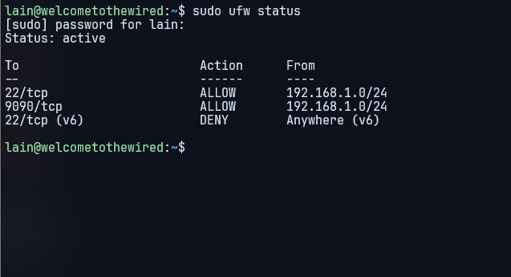
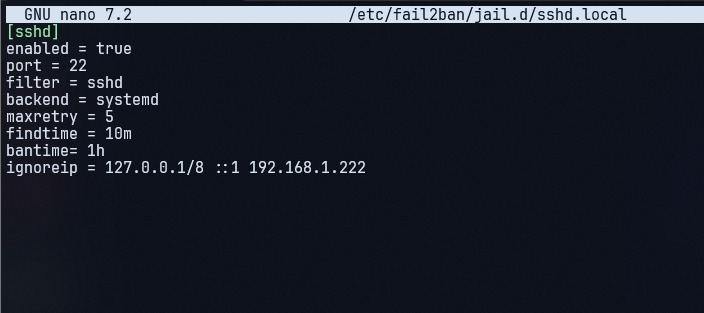
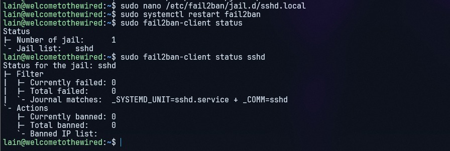
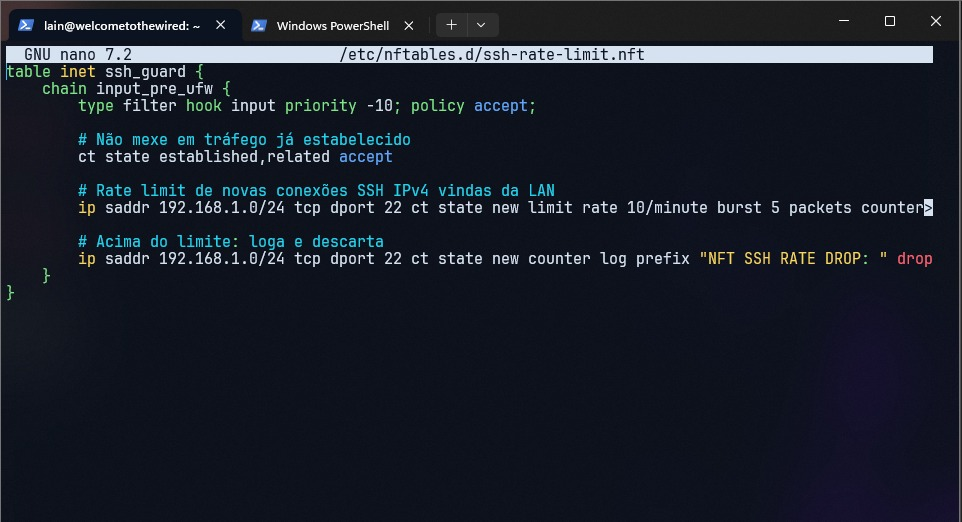
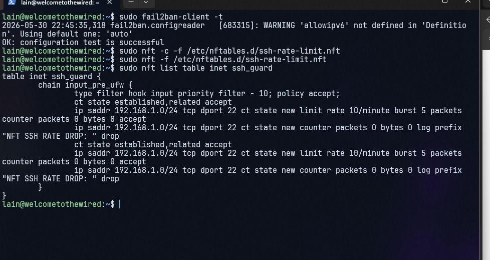
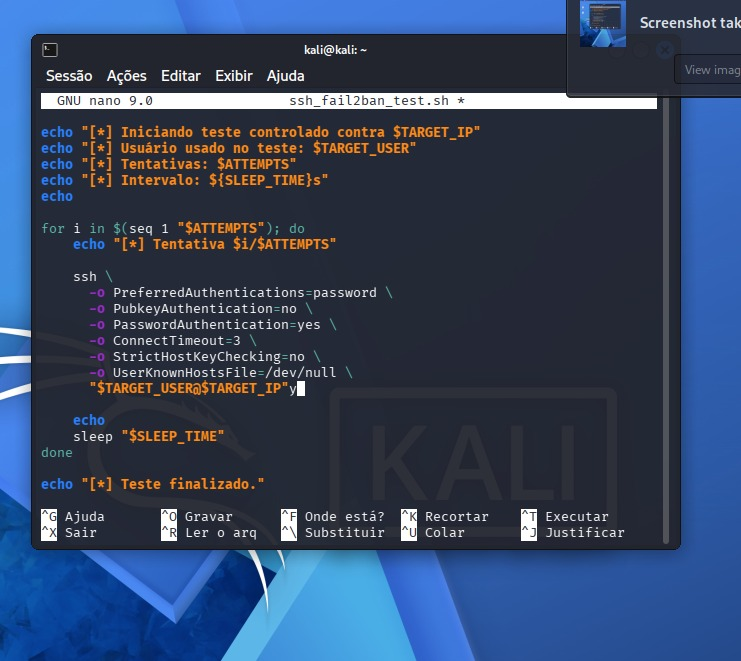
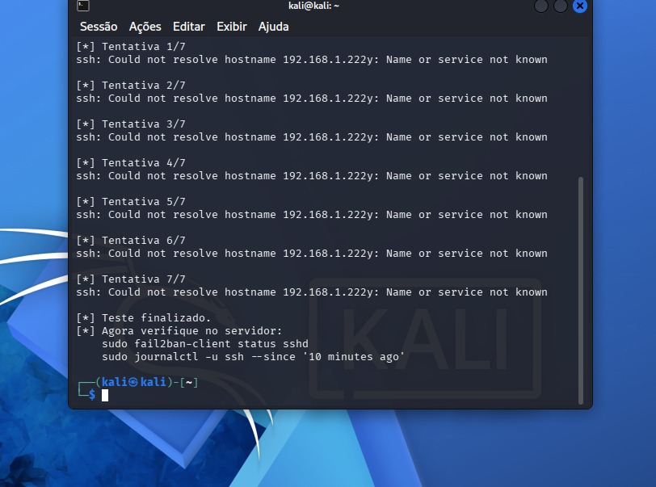
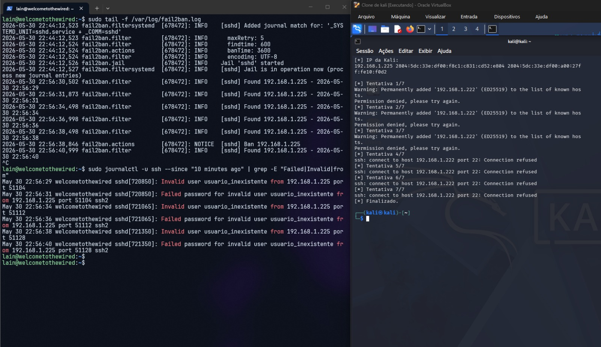
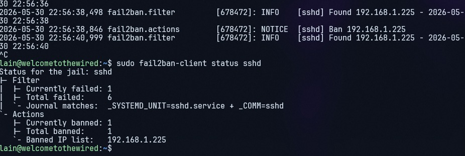

# Laboratório de Hardening SSH com UFW, nftables e Fail2Ban

Este repositório documenta um laboratório controlado de defesa em servidor Linux físico, com foco em hardening de SSH, análise de logs e bloqueio automático de tentativas repetidas de autenticação inválida.

O ambiente foi montado em um **servidor físico com Ubuntu Server**, acessado por SSH a partir de uma máquina principal. Os testes controlados foram executados a partir de uma **VM Kali Linux em modo Bridge**, permitindo que a Kali recebesse um IP próprio na rede local e fosse identificada separadamente pelo servidor.

> Objetivo: validar o ciclo defensivo completo: tentativa de login inválida → registro em log → detecção pelo Fail2Ban → bloqueio do IP de origem → validação no firewall/nftables.

---

## Topologia do laboratório

```text
PC principal / Administração
192.168.1.x
        |
        | SSH legítimo
        v
Servidor físico Ubuntu Server
192.168.1.222
        ^
        | tentativas controladas de autenticação inválida
        |
Kali Linux VM em modo Bridge
192.168.1.225
```

### Por que o modo Bridge foi importante?

O modo **Bridge** foi essencial porque fez a VM Kali aparecer na mesma rede do servidor com **IP próprio**. Assim, o Fail2Ban conseguiu identificar o endereço real que estava gerando falhas de autenticação.

Se a VM estivesse em modo **NAT**, o servidor poderia enxergar as conexões como se viessem do host físico, gerando confusão na identificação da origem e risco de bloquear a máquina administrativa em vez da VM de teste.

Em resumo:

```text
Bridge = Kali com IP próprio na LAN → melhor para labs de rede/firewall
NAT    = tráfego pode sair mascarado pelo host → ruim para atribuição por IP
```

---

## Componentes usados

- Ubuntu Server em hardware físico
- SSH/OpenSSH
- UFW
- nftables
- Fail2Ban
- Kali Linux em VM Bridge
- sshpass para teste controlado de autenticação inválida
- journalctl e fail2ban-client para validação

---

## Configuração inicial do UFW

O firewall local foi configurado para permitir SSH apenas na rede local, liberar Cockpit apenas na LAN e negar SSH via IPv6.

Evidência:



Estado esperado:

```text
22/tcp      ALLOW  192.168.1.0/24
9090/tcp    ALLOW  192.168.1.0/24
22/tcp (v6) DENY   Anywhere (v6)
```

---

## Configuração do Fail2Ban

Arquivo utilizado:

```text
/etc/fail2ban/jail.d/sshd.local
```

Conteúdo base:

```ini
[sshd]
enabled = true
port = 22
filter = sshd
backend = systemd
maxretry = 5
findtime = 10m
bantime = 1h
ignoreip = 127.0.0.1/8 ::1 192.168.1.222
```

Evidência:



Após editar, os comandos usados foram:

```bash
sudo fail2ban-client -t
sudo systemctl restart fail2ban
sudo fail2ban-client status
sudo fail2ban-client status sshd
```

Evidência do status do jail ativo:



---

## Rate limit com nftables

Além do UFW, foi criada uma tabela temporária no nftables para estudo de rate limit de novas conexões SSH.

Arquivo:

```text
/etc/nftables.d/ssh-rate-limit.nft
```

Configuração:

```nft
table inet ssh_guard {
    chain input_pre_ufw {
        type filter hook input priority -10; policy accept;

        ct state established,related accept

        ip saddr 192.168.1.0/24 tcp dport 22 ct state new limit rate 10/minute burst 5 packets counter accept

        ip saddr 192.168.1.0/24 tcp dport 22 ct state new counter log prefix "NFT SSH RATE DROP: " drop
    }
}
```

Evidência da criação:



Aplicação e listagem:

```bash
sudo nft -c -f /etc/nftables.d/ssh-rate-limit.nft
sudo nft -f /etc/nftables.d/ssh-rate-limit.nft
sudo nft list table inet ssh_guard
```

Evidência:



> Observação: essa regra foi usada como parte do laboratório. Em ambiente real, o Fail2Ban já cumpre o papel principal de bloqueio por falhas de autenticação, enquanto o nftables pode complementar com rate limit e visibilidade.

---

## Script de teste controlado com sshpass

Na Kali Linux, foi usado um script simples para gerar falhas de autenticação SSH de forma controlada.

Arquivo no repositório:

```text
scripts/ssh_fail2ban_test.sh
```

Instalação do sshpass na Kali:

```bash
sudo apt update
sudo apt install sshpass -y
```

Execução:

```bash
chmod +x ssh_fail2ban_test.sh
./ssh_fail2ban_test.sh
```

Evidência do script:



Evidência da execução finalizada:



---

## Validação nos logs do servidor

Durante a execução do script, o servidor registrou tentativas inválidas no serviço SSH e o Fail2Ban detectou o IP da Kali.

Comandos usados no servidor:

```bash
sudo tail -f /var/log/fail2ban.log
sudo journalctl -u ssh --since "10 minutes ago" | grep -E "Failed|Invalid|from"
sudo fail2ban-client status sshd
```

Evidência dos logs e banimento:



Status final do jail `sshd`:



Resultado observado:

```text
IP da Kali: 192.168.1.225
Total failed: 6
Currently banned: 1
Banned IP list: 192.168.1.225
```

---

## Ciclo defensivo observado

```text
1. Kali tenta login SSH com usuário inexistente
2. OpenSSH registra Invalid user / Failed password
3. Fail2Ban detecta os eventos via systemd journal
4. Após atingir maxretry, o IP da Kali é banido
5. Novas conexões da Kali recebem bloqueio/recusa
6. O status do jail sshd mostra o IP banido
```

---

## Lições aprendidas

- UFW é uma camada simples e eficiente para política básica de firewall.
- nftables permite observar e estudar regras mais finas, como rate limit, counters e logs.
- Fail2Ban é mais adequado para bloquear IPs com base em falhas reais de autenticação.
- O modo Bridge é muito importante em labs de rede porque preserva a identidade de IP da VM.
- Logs são essenciais para validar defesa: sem `journalctl`, `auth.log` e `fail2ban.log`, o bloqueio vira uma caixa preta.
- Testes ofensivos controlados precisam de escopo claro, ambiente próprio e rollback documentado.

---

## Rollback

Para remover a tabela de rate limit do nftables:

```bash
sudo nft delete table inet ssh_guard
```

Para desbanir todos os IPs no Fail2Ban:

```bash
sudo fail2ban-client unban --all
```

Para desbanir apenas a Kali:

```bash
sudo fail2ban-client set sshd unbanip 192.168.1.225
```

Para reiniciar o serviço:

```bash
sudo systemctl restart fail2ban
```

Mais detalhes em [`docs/rollback.md`](docs/rollback.md).

---

## Aviso ético

Este laboratório foi executado em ambiente próprio e controlado. O uso de scripts para gerar tentativas de autenticação contra sistemas de terceiros sem autorização é inadequado e pode violar leis e políticas institucionais. O objetivo deste projeto é exclusivamente defensivo e educacional.
